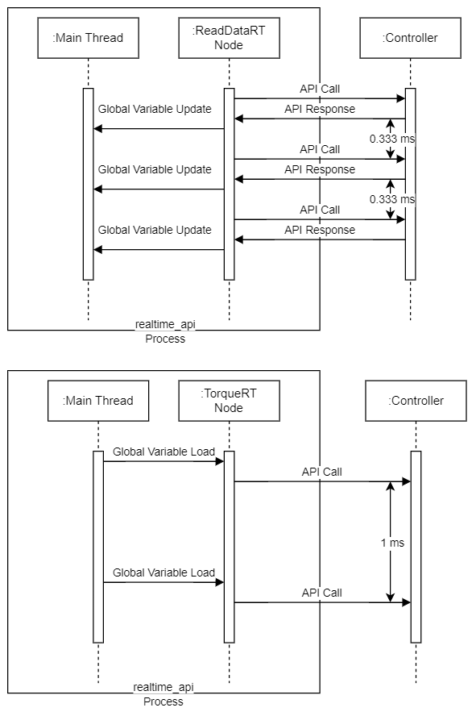
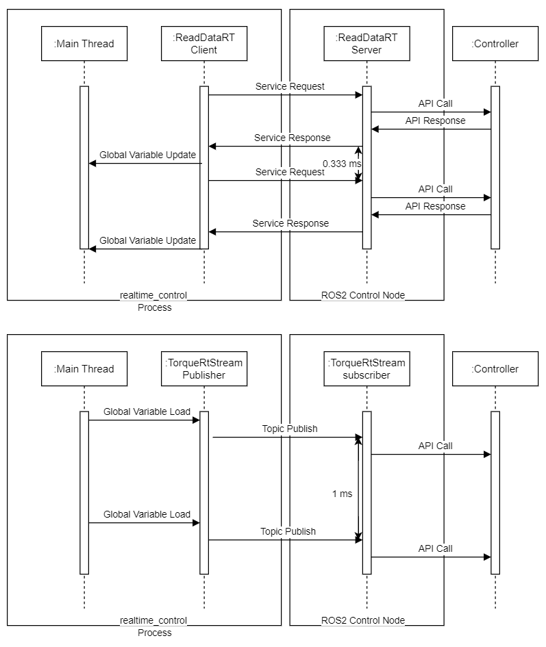
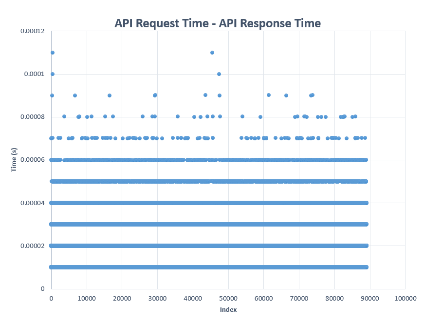

# Realtime Control Example

## Overview

This package provides the function to control **m1013** model of Doosan robots in the ROS2(Humble) environment.
You will be given two options(**Option [1] is recommended**):

**[1]** It provides a way to control the robot using the Doosan API **without using the communication interface** of ROS2.

**[2]** It provides a way to use the realtime control function of Doosan API **through ROS2's Service and Topic communication interfaces**.

## Notice

1. There is a **problem with Option [2] to secure control intervals**. 
   There is a case where it takes about 20ms to acquire data through the ROS2 communication interface. 
   As a result, control behaviors that require less than 20 ms can be problematic.
2. For the **torque_rt** command, it **cannot be used in Virtual mode** because physics simulation is not performed in DRCF.


## Prerequisite

This example utilizes the scheduling policy setting feature of Pthreads. 
Therefore, we strongly recommend using a **Linux operating system**.
Additionally, we recommend running your program on the **Preempt_rt Kernel** to ensure control periodicity.
[**Real-time Ubuntu**](https://ubuntu.com/real-time) is Ubuntu with a real-time kernel. Ubuntu’s real-time kernel includes the [**PREEMPT_RT**](https://wiki.linuxfoundation.org/realtime/documentation/technical_details/start) patchset. 
Tutorial for Realtime-Ubuntu can be found at the following link: 
[Tutorial: Your first Real-time Ubuntu application - Real-time Ubuntu documentation](https://documentation.ubuntu.com/real-time/en/latest/tutorial/)


## Communication Structure

### Option 1:



1. Call **ReadData API** at 3000 Hz (0.333 ms).
2. Call **TorqueRt API** at 1000Hz (1 ms).

### Option 2: 



1. Request **ReadData service** at 3000 Hz (0.333 ms).
2. Publish **TorqueRtStream Topic** at 1000 Hz (1 ms).


## Tutorial

### Option 1:

```bash
## Real Mode (Available)

# By entering the following command line, you can get control authority from TP to your device
$ ros2 launch dsr_bringup2 dsr_bringup2_rviz.launch.py mode:=real host:=192.168.137.100 port:=12345 model:=m1013

# By entering the following command line, option1 will be executed
$ ros2 run realtime_control realtime_api
```

```bash
## Virtual Mode (Not available for now)
```

### Option 2:

```bash
## Real Mode (Limitedly available)

# By entering the following command line, you can get control authority from TP to your device
$ ros2 launch dsr_bringup2 dsr_bringup2_rviz.launch.py mode:=real host:=192.168.137.100 port:=12345 model:=m1013

# By entering the following command line, ros2 control node can connect_rt_control using UDP/IP protocol
$ ros2 run realtime_control rt_init

# By entering the following command line, option2 will be executed
$ ros2 run realtime_control realtime_control

# If you want to stop realtime connection(Not mandatory), Enter the following command line
$ ros2 run realtime_control rt_shutdown
```

```bash
## Virtual Mode (Not available for now)
```
## Result of Execution(Gravity Compensation)


## Performance Test

### Test Environment

1. OS: Ubuntu 22.04.4 LTS(64-bit)
2. CPU: Intel Core i5-6500 CPU
3. Graphics: Mesa Intel HD Graphics 530 (SKL GT2)
4. RAM: 16.0 GiB

### Option 1: 

#### 1. With No Scheduling

```bash
$ ros2 run realtime_control realtime_api
```


A 30-seconds test results showed a maximum response time of 1.6 ms.

**Not suitable for torque control.**

#### 2. With Scheduling

```bash
$ ros2 run realtime_control realtime_api --sched SCHED_FIFO --priority 90
```


(Use Excel for statics.)

A 30-seconds test results showed a response time of up to 0.11 ms.

**Suitable for torque control.**

### Option 2: 

#### 1. With No Scheduling

```bash
$ ros2 run realtime_control rt_init
$ ros2 run realtime_control realtime_control
```

A 30-seconds test results showed a maximum response time of up to 13 ms.

**Not suitable for torque control.**

#### 2. With Scheduling

```bash
$ ros2 run realtime_control rt_init
$ ros2 run realtime_control realtime_control --sched SCHED_FIFO --priority 90
```


The overall response has improved.
A 30-seconds test results showed a maximum response time of 13 ms.

**Not suitable for torque control.**

